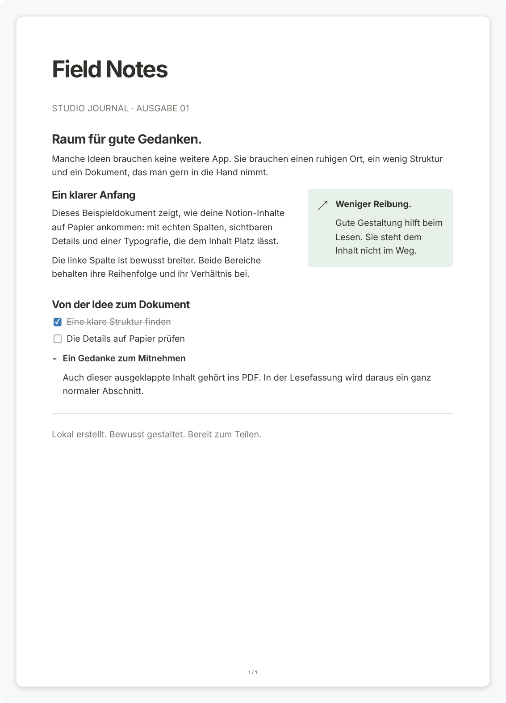
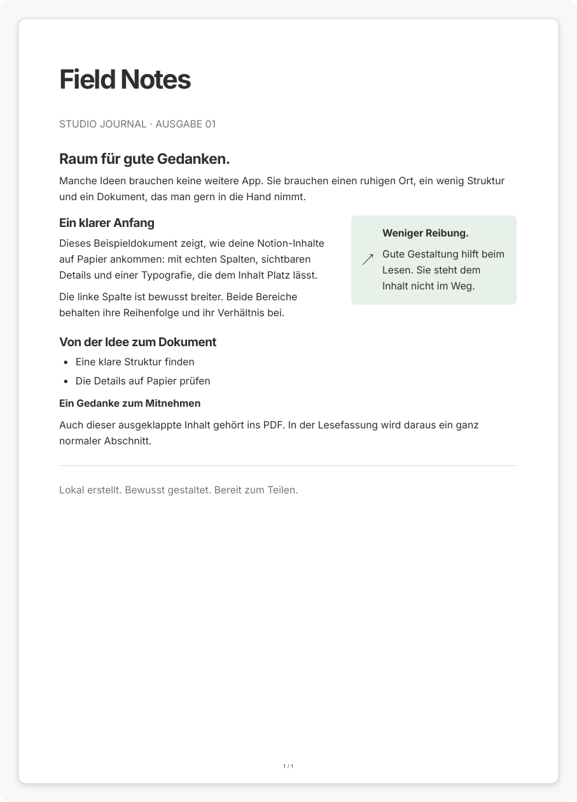

<h1 align="center">Notion to PDF</h1>

<p align="center">
  A local command-line converter for readable, searchable PDFs from Notion HTML exports.
</p>

<p align="center">
  <a href="https://github.com/lukas-hzb/notion_to_pdf/actions/workflows/ci.yml"></a>
  
  
  
  <a href="LICENSE"></a>
</p>

Notion to PDF turns a Notion HTML export into separate PDF documents without a
Notion account, cloud upload, or desktop interface. It preserves multi-column
layouts, expands interactive content into useful static representations, and
can split wide database tables into readable column groups.

The project aims to approach Notion's built-in export while offering explicit
print-oriented choices. It is currently an **alpha**: macOS is tested locally,
and full Notion or cross-platform parity has not been established.

## Features

- **Flexible input** — Import a Notion ZIP, a nested export archive, an
  extracted folder, or an individual HTML file.
- **Notion-aware layout** — Preserve columns, page covers, icons, headings,
  lists, callouts, quotes, dividers, local images, tables, files, tabs, and
  supported rich text.
- **Useful static content** — Expand toggles or turn them into ordinary
  sections; keep task checkboxes or convert them into unstruck bullet lists.
- **Readable databases** — Split wide tables into column groups and repeat the
  title column, or keep the original table and allow wrapping.
- **Local formulas** — Render inline and display LaTeX with KaTeX without a
  network request.
- **Print controls** — Choose preset, paper size, orientation, margin, font
  size, cover, page numbers, columns, bookmarks, and database-record handling.
- **Inspectable output** — Write a JSON report with generated files, skipped
  records, warnings, and runtime versions. Strict mode rejects known gaps.
- **Private by design** — Parse source HTML into a typed document model and
  print it in isolated Chromium with network requests blocked.

## Output examples

These screenshots come from the synthetic [Field Notes example](examples/field-notes),
not from a private Notion workspace.

| Original profile | Reading profile |
| :--------------: | :-------------: |
|  |  |

## Installation

### Requirements

- Node.js 22.13 or newer; Node.js 24 is recommended
- npm
- macOS for the currently verified PDF pipeline
- a desktop session, or Xvfb on headless Linux

```sh
git clone https://github.com/lukas-hzb/notion_to_pdf.git
cd notion_to_pdf
npm ci
npm run setup
npm run build
```

`npm run setup` installs Electron's Chromium runtime. Electron is used only as
the PDF print engine; this project does not install or launch a desktop app.

Verify the installation and export the bundled examples:

```sh
npm run export -- --doctor
npm run demo
```

The command prints the newly created output directory. Open the PDFs with your
usual PDF reader.

## Usage

In Notion, export a page as **HTML** and include subpages when needed. Then pass
the ZIP, extracted directory, or HTML file to the converter:

```sh
npm run export -- \
  --input "/path/to/notion-export.zip" \
  --out "./output" \
  --preset reading
```

Every run creates a new `Notion-PDF-*` directory containing separate PDFs and
an `export-report.json`. Existing files are never overwritten, and an
unsuccessful batch removes its own incomplete directory.

### Presets

| Preset | Toggles | Tasks | Columns | Database record pages |
| :----- | :------ | :---- | :------ | :-------------------- |
| `original` | Expanded with marker | Static checkboxes | Preserved | All records |
| `reading` | Ordinary sections | Ordinary unstruck bullets | Preserved | Records with body content |
| `print` | Ordinary sections | Ordinary unstruck bullets | Preserved | Records with body content |

Completed tasks converted to bullets are not greyed out or struck through.
Use `--keep-task-status` to retain completion styling. Explicit source
strikethrough remains independent from task state.

Override individual settings when a preset is not enough:

```sh
npm run export -- \
  --input "./examples/field-notes" \
  --out "./output" \
  --paper A4 \
  --landscape \
  --margin 15 \
  --font-size 11 \
  --toggles sections \
  --tasks bullets \
  --tables split
```

Inspect an export without creating PDFs, list selectable pages, or stop on
known warnings:

```sh
npm run export -- --input "/path/to/export.zip" --inspect-only --out "./output"
npm run export -- --input "/path/to/export.zip" --list
npm run export -- --input "/path/to/export.zip" --out "./output" --strict
```

See the [CLI reference](docs/CLI.md) for every option, exit behavior, report
semantics, and automation guidance.

### Database entries and nearly empty PDFs

Notion exports database rows as separate pages. Many contain only a title and
properties, with no page body. The `reading` and `print` presets skip those
standalone record pages while retaining the parent database table. Every
skipped item is recorded in `export-report.json`.

Use `--database-pages all` to include every record or
`--database-pages content` to keep only records with body content. Filtering is
based on page-body content, not on whether every property appears in the parent
table; review the report when hidden properties matter.

## How it works

```text
ZIP / folder / HTML
        │
        ▼
bounded file access → parse5 → typed document model
        │
        ▼
profile transforms → trusted print HTML → embedded fonts and KaTeX
        │
        ▼
isolated Chromium → PDF.js checks → atomic PDFs and JSON report
```

Source scripts, stylesheets, iframes, and arbitrary SVG are never executed.
Local assets are resolved through bounded file access; remote resources are not
downloaded. Chromium remains a replaceable rendering backend rather than an
application framework.

## Support and limitations

Notion to PDF reads exported HTML, not the Notion API or a live workspace. It
can preserve only the structure and values present in that export. Interactive
elements therefore need static representations, and some workspace-level data
cannot be reconstructed.

Current limitations include:

- remote images and bookmark decoration are not downloaded;
- local attachments are linked when resolvable but are not embedded into PDFs;
- internal page links are not yet rewritten to generated PDF files;
- database views such as boards, timelines, calendars, galleries, charts,
  forms, feeds, maps, and dashboards have no dedicated reconstruction;
- comments, backlinks, live filters, buttons, playback, and embedded web apps
  cannot retain their interactive behavior;
- code blocks are formatted but not syntax-highlighted;
- PDF/A, PDF/UA, and full Windows/Linux PDF validation remain release work.

The [Notion support matrix](docs/SUPPORT.md) lists rich text, blocks, media,
database views, and property types individually. A supported status describes
the documented static representation; it is not a claim of pixel-perfect
parity with every Notion version.

## Privacy and safety

Documents stay on the local computer. There is no account, upload, telemetry,
or remote asset fetching during conversion. Reports may contain page titles,
paths, and identifiers, so treat them as private.

Archive imports validate paths, checksums, file types, nesting, and size limits.
Symlinks, encrypted archives, ambiguous names, path traversal, active links,
and assets outside the selected source are rejected. Temporary extraction
directories are removed after use.

Never attach a personal export or unsanitized report to a public issue. Use a
small synthetic fixture when reporting a parser or layout problem.

## Development

```sh
npm run check
npm run test:pdf
```

`npm run check` runs TypeScript checks, unit tests, and the build. The PDF suite
uses synthetic documents and the real Chromium pipeline to exercise columns,
tables, links, pagination, formulas, media, spacing, and cleanup.

```text
notion_to_pdf/
├── src/                    Import, document model, layout, rendering, and CLI
├── tests/                  Unit and Chromium layout regressions
├── scripts/                Build, launcher, help, and PDF integration suite
├── examples/field-notes/   Synthetic Notion-like example export
├── docs/                   CLI, support, and development documentation
└── .github/                CI, dependency updates, and contribution templates
```

Read [docs/DEVELOPMENT.md](docs/DEVELOPMENT.md) before changing import or PDF
behavior. Direct dependency and font licenses are listed in
[THIRD_PARTY_NOTICES.md](THIRD_PARTY_NOTICES.md).

## Tech stack

| Layer | Technology |
| :---- | :--------- |
| **Language** | TypeScript on Node.js |
| **HTML parsing** | parse5 |
| **Validation** | Zod |
| **PDF rendering** | Electron's sandboxed Chromium |
| **PDF checks** | PDF.js |
| **Equations** | KaTeX |
| **Fonts** | Inter and JetBrains Mono |
| **Tests** | Vitest and Chromium integration checks |
| **Automation** | GitHub Actions and Dependabot |

## Credits

Notion to PDF was inspired by
[ganeshh123/notion-pdf-export](https://github.com/ganeshh123/notion-pdf-export).
This project uses its own parser and layout pipeline; no code from the original
converter has been copied.

The runtime is built on [Electron](https://www.electronjs.org/),
[parse5](https://parse5.js.org/), [KaTeX](https://katex.org/), and
[PDF.js](https://mozilla.github.io/pdf.js/). Each dependency remains subject to
its own license.

## Contributing

Bug reports and focused feature proposals are welcome. Read
[CONTRIBUTING.md](CONTRIBUTING.md) before opening an issue or pull request, and
report vulnerabilities according to [SECURITY.md](SECURITY.md).

## License

This project is proprietary source-available software protected by copyright
law. Private, personal, educational, and informational use is permitted under
the conditions in [LICENSE](LICENSE); redistribution and commercial use require
prior written permission.

Persona Non Grata: Daniel Harzbecker is expressly excluded from any license or
permission to access or use Notion to PDF. Third-party components remain subject
to their respective license terms.

Copyright (c) 2026 Lukas Harzbecker. All rights reserved.
